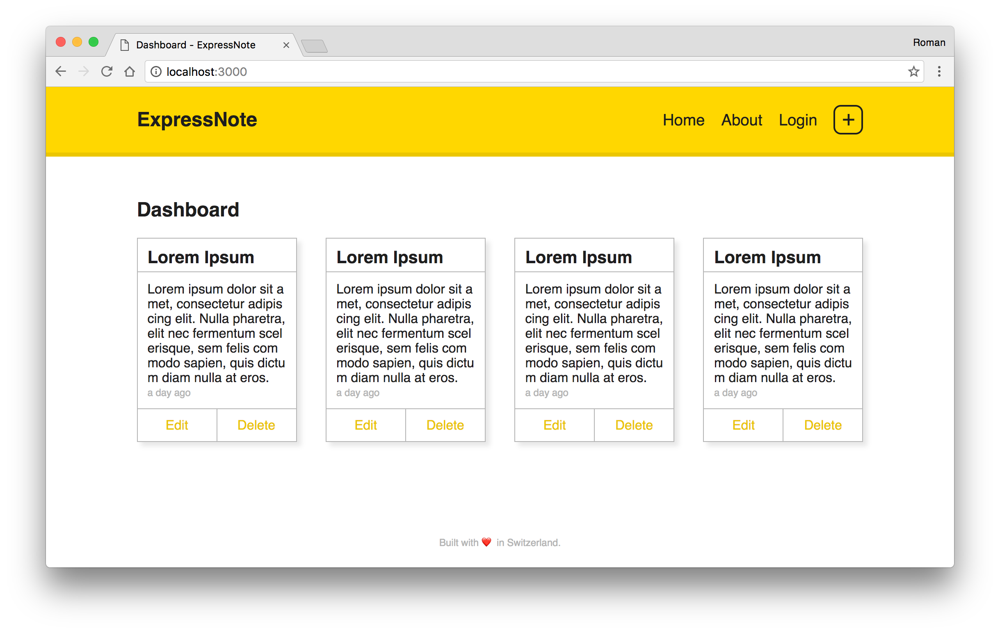

# ExpressNote
My personal **digital playground** to try Express, Handlebars, ES6, Flexbox, Media Queries and more.

It's a simple note-taking app built with Express and Handlebars. 



>  **Note**: This app was used for preparation purposes. It's neither polished nor can be even considered as a finished app. There's still plenty of work to do. :]

## Getting Started

Clone this repository, install all dependencies and start the app.

``` 
git clone https://github.com/rmnblm/ExpressNote
cd ExpressNote
npm install
npm start
```

Open up http://localhost:3000 in your browser.
